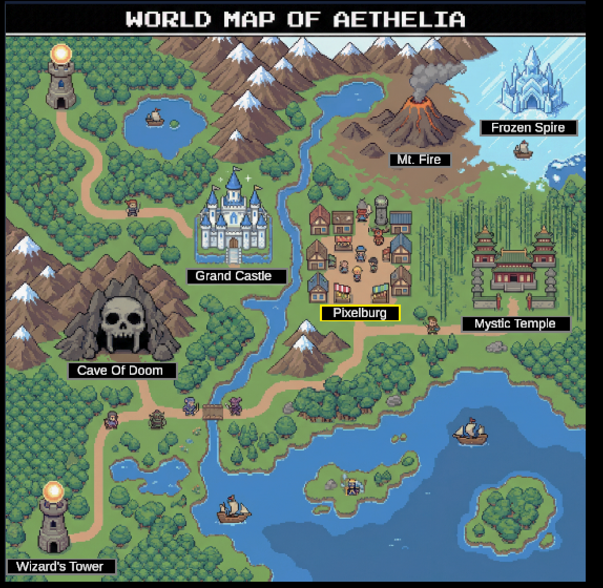
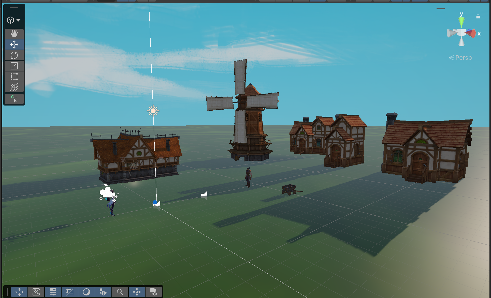
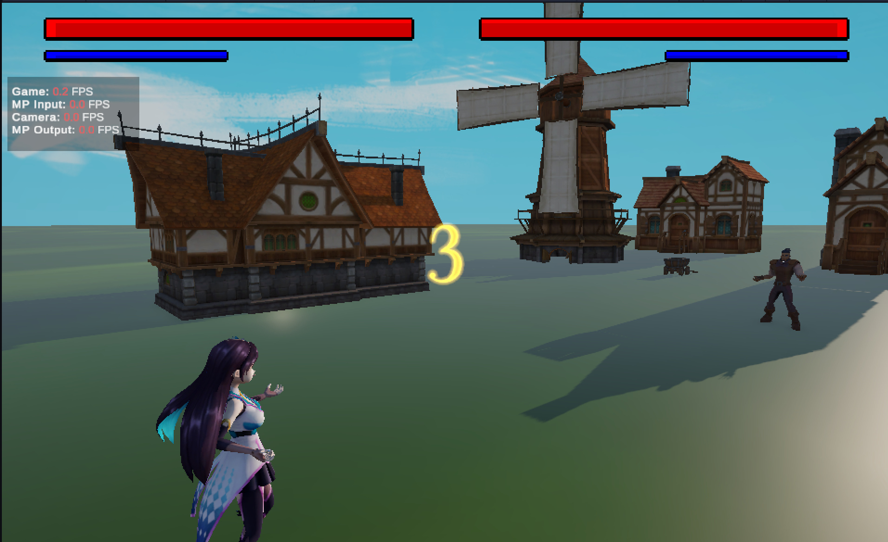
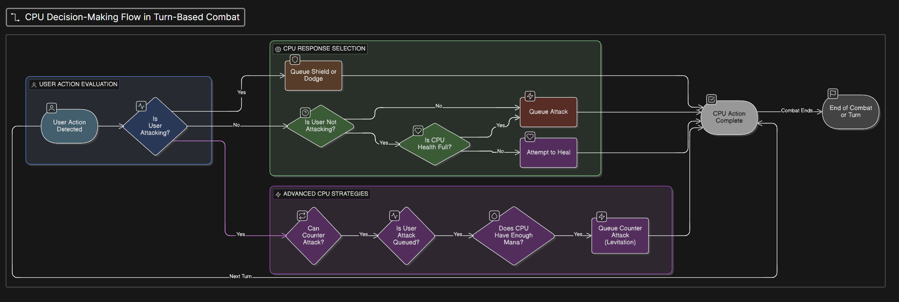

# Learning with AI — Wizards Game Project
### A Reflection on AI-Assisted Development

---

## How I Used AI Tools

Throughout this project I worked with several AI assistants and tools — **Claude**, **UnityAI**, **ChatGPT**, **eraser.io**, and **Gemini** — each in different ways to help me build, learn, and solve problems.

--- 

| Tool | Primary Use |
|---|---|
| **Claude** | Code debugging, Unity scripting help, real-time problem solving, and generating markdown flow descriptions to visualize game logic |
| **ChatGPT** | Brainstorming game mechanics, explaining machine learning concepts, writing first drafts of logic |
| **Gemini** | Researching Unity-specific documentation, comparing implementation approaches |
| **UnityAI** | Fast in-editor wiring of GameObjects to scripts during early development |
| **eraser.io** | Generating flowchart diagrams to visualize logic and design |

---

## Topic 1: Supervised Learning for Custom Gesture Classification

### What It Is
Supervised learning is a type of machine learning where a model is trained on **labeled examples** — in this case, gesture data paired with the correct gesture name — so it can predict the correct label on new input.

---

### Preparing Labeled Gesture Training Data

- Last semester we used AI to brainstorm and identify the best way to solve the problem we had, which was identifying hand gestures using Machine Learning
- We determined that Google's MediaPipe was the easiest solution
  - Allowed us to have preset hand gestures it's trained on and all we had to do was take those gestures and implement them into our game
  - This laid the groundwork for us to expedite our MVP
- This semester we are continuing to take these hand gestures and add new and refreshing combos / spells — see [Spell Unlock Implementation](SpellUnlockImplementation.md)

---

### Choosing and Evaluating Classification Approaches

- Asked Claude and ChatGPT to compare classifiers for gesture input
  - We landed on having the hand gesture input output as a pair of strings outputting the type of hand gestures being made by both hands
- Used AI to help walk us through how to implement MediaPipe from simple string outputs to tying that into in-game actions

---

### Improving Classification Accuracy Across Different Users

- Issues we ran into
  - Users with smaller or darker skin tones may have a harder time being detected by the game
  - Hand detection in darker lighting settings is significantly slower

---

- Solutions
  - Used AI to code detection settings allowing multiple frames to be captured with generosity for "missed frames"
    - This significantly improved detection across various hands and in poor lighting
  - AI suggested additional ideas for poor lighting:
    - Include a white ring around the game
    - Prompt users to adjust their environment for better lighting
  - The white ring was minimal in effect and hurt the UI experience — not implemented

---

### Integrating Gesture Prediction into Real-Time Gameplay

- Got help wiring the gesture classifier output into Unity's game loop — see [Map User Flow](MapUserFlow.md)
  - Initially we used Unity's AI — fast but made many mistakes; still useful for speedy development
  - Unity AI was later broken and frequently crashed the editor, so we moved to VSCode / Cursor
  - This required describing full editor context to the AI rather than it seeing it directly
- Used AI to troubleshoot timing issues between gesture detection and spell casting
  - It took a lot of refinement to determine the best number of frames to capture before queuing a gesture

---

---

### Sourcing Assets and Optimizing Scene Performance

- Claude walked me through how to search and filter the Unity Asset Store for free assets that fit the game's visual style
- After importing assets, framerate was negatively impacted by high-polygon models
- Claude explained how polycount affects render performance and walked me through:
  - Identifying high-polycount meshes using Unity's profiler and stats panel
  - Using Unity's LOD (Level of Detail) system to swap in lower-poly versions at distance
- These optimizations restored smooth framerate without sacrificing the look of the scene

---

---

---

### What I Learned — Topic 1

> Supervised learning is only as good as the data behind it. I learned that giving enough context is the most important part of working with AI. The more precise the data given the more depth the model has, and usually leads to more accurate responses that give the solutions / debugging you're looking for.

---

## Topic 2: Reinforcement Learning for "Smart" Enemy Reactions

### What It Is
Reinforcement learning (RL) is where an agent learns by **trial and error** — taking actions, receiving rewards or penalties, and over time developing a policy that maximizes its reward. In this project, the enemy AI learns to react to the player.

---

### The Goal

- Within the campaign I am working to make the enemies feel more responsive and not just do randomized attacks
- Currently the enemies just do random attacks from the list of spells
- This causes issues such as:
  - Opponent healing when already at full health
  - Dodging "phantom" attacks that don't exist
  - Never intentionally performing counter attacks such as levitating and throwing mana balls (which would dodge the incoming attack and counter with several mana balls)

---

### Designing Signals for Enemy Behavior

- AI helped me think through what the enemy should be trained for (e.g. dealing damage, surviving, successfully countering a spell)
  - Easier implementations:
    - If the user is sending an attack → CPU attempts to queue a shield or dodge
    - If no attack is queued → CPU attempts to heal if health is not full
    - Else → queue an attack
  - More complex implementations:
    - Timing a counter attack like the levitation move described above

---

---

### Using Markdown Flow Descriptions to Understand Game Logic

- Asking Claude to generate markdown-based flow descriptions of game systems was crucial for understanding what changes were happening under the hood
- Rather than just reading code, having the logic laid out as a structured flow made it much easier to:
  - Visualize how different systems connected and interacted
  - Identify where in the flow a new behaviour or fix needed to be inserted
  - Communicate the intended logic clearly before writing any code
- This gave me a stronger understanding of the interworkings of the game and made me a more confident developer when implementing changes

---

### Training CPU to React to Player Gestures and Spell Usage

- Used AI to understand how to structure the enemy's observation space — what information it receives about the player
- Got help defining the action space — what choices the enemy can make each turn

---

### Balancing Challenge, Fairness, and Unpredictability

- AI helped me think about the difference between a "hard" enemy and a "fun" enemy
- AI gave examples of how to tune parameters to adjust difficulty
- Used AI to understand how to prevent the enemy from becoming too predictable or too random
  - **CPU Presets:** Health, Mana, Mana Regen Time, Spell Cooldown, Unlocked Spells, Attack Damages
  - **Adjustable Counters:**
    - What % of attacks are countered
    - When countering — defense only vs. full counter attack (counter attack being more difficult)

---

### Iterating on Policies Based on In-Game Outcomes

- Playtested and used AI to help me read training logs and understand when the policy was improving
- Learned when to reset training vs. continue from a checkpoint
- Made design decisions based on observed behavior, validating each change myself

---

### What I Learned — Topic 2

> Reinforcement learning requires patience and careful design. The enemy doesn't just "get smarter" — you have to deliberately design what smart means through in game actions, and then validate it through play. AI tools helped me understand the theory while the implementation and tuning was tested manually to best collect feedback from a player and get a feel for the difficulty of the opponent.

---

## Key Takeaways

1. **AI tools accelerate learning** — I could ask questions and get detailed explanations instantly rather than spending hours reading documentation
2. **AI doesn't replace the work** — every model, script, and design decision was built, tested, and validated by me
3. **Different tools for different needs** — Claude for live coding help, ChatGPT for concept explanation, Gemini for research, UnityAI for fast in-editor wiring, and eraser.io for visualizing logic
4. **Failure is part of the process** — both supervised and reinforcement learning required many iterations, and AI helped me diagnose what was going wrong each time

---

## What I Built and Accomplished

- Designed and implemented a gesture classification pipeline integrated into real-time gameplay
- Built and enemy that reacts dynamically to player spell usage
- Developed a working Wizards Game in Unity with custom AI-driven mechanics
- Gained hands-on experience with core machine learning concepts by applying them to a real project

---

*All gameplay systems were designed, implemented, and validated by me. AI tools were used as learning aids and development accelerators.*
